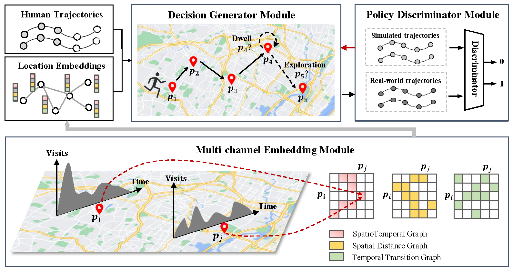

# STAR

The official implementation of 'Spatiotemporal-Augmented Graph Neural Networks for Human Mobility Simulation' (TKDE). 

Please consider giving this repository a star ⭐ if you find it helpful!



> **<p align="justify"> Abstract:** Human mobility patterns have shown significant applications in policy-decision scenarios and economic behavior researches. The human mobility simulation task aims to generate human mobility trajectories given a small set of trajectory data, which have aroused much concern due to the scarcity and sparsity of human mobility data. Existing methods mostly rely on the static relationships of locations, while largely neglect the dynamic spatiotemporal effects of locations. On the one hand, spatiotemporal correspondences of visit distributions reveal the spatial proximity and the functionality similarity of locations. On the other hand, the varying durations in different locations hinder the iterative generation process of the mobility trajectory. Therefore, we propose a novel framework to model the dynamic spatiotemporal effects of locations, namely SpatioTemporal-Augmented gRaph neural networks (STAR). The STAR framework designs various spatiotemporal graphs to capture the spatiotemporal correspondences and builds a novel dwell branch to simulate the varying durations in locations, which is finally optimized in an adversarial manner. The comprehensive experiments over four real datasets for the human mobility simulation have verified the superiority of STAR to state-of-the-art methods. Our code is available at https://github.com/Star607/STAR-TKDE. </p>

## 📚 Citation
If you find our work useful in your research, please consider citing 🌷:
```
@article{wang2024spatiotemporal,
  author={Wang, Yu and Zheng, Tongya and Liu, Shunyu and Feng, Zunlei and Chen, Kaixuan and Hao, Yunzhi and Song, Mingli},
  journal={IEEE Transactions on Knowledge and Data Engineering}, 
  title={Spatiotemporal-Augmented Graph Neural Networks for Human Mobility Simulation}, 
  year={2024},
  volume={36},
  number={11},
  pages={7074-7086},
  doi={10.1109/TKDE.2024.3409071}
}
``` 

## ⚙️ Installation

- Environment
    - Tested OS: Linux
    - Python >= 3.9
    - PyTorch == 1.10.2

- Dependencies
    - Install PyTorch 1.10.2 with the correct CUDA version.
    - Execute ``pip install -r requirements.txt`` command to install all of the Python modules and packages used in this project.


## 🚀 Running

- Data Pre-process
  - run `python stg_gen.py` to generate the files in `./saved_data` directory as follows:

```
├── assets
│   └── framework.png
├── discriminator.py
├── generator.py
├── graph_model.py
├── helpers.py
├── main.py
├── README.md
├── requirements.txt
├── requirement.txt
├── saved_data
│   └── NYC
│       ├── fea_dim_32_sdg_edges.csv
│       ├── fea_dim_32_sdg_nodes.csv
│       ├── fea_dim_32_stg_edges.csv
│       ├── fea_dim_32_stg_nodes.csv
│       ├── fea_dim_32_ttg_edges.csv
│       ├── fea_dim_32_ttg_nodes.csv
│       ├── sdg_all.npy
│       ├── sdg.npz
│       ├── stg_all.npy
│       ├── stg.npz
│       ├── ttg_all.npz
│       └── ttg.npz
├── stg_gen.py
└── weighted_gatconv.py
```

- Model Training & Trajectory Generation
  - `python main.py`
  - `--datapath`: the path of data for each city
  - `--propath`: the path of pre-processed files 
  - `--savepath`: the path to save checkpoints and generated trajectories
  - `--mle_train_epochs`: epochs to pre-train the generator
  - `--adv_train_epochs`: epochs for adversarial training
  - `--graph_channels`: the number of graph channels
  - `--edge_type`: the type of edges in each graph
  - `--p_stay`: the parameter type in dwell branch module
  - `--gene_num`: the number of generated trajectories


## 📃 Related Works
- [COLA: Cross-city Mobility Transformer for Human Trajectory Simulation. (WWW 2024)](https://github.com/Star607/Cross-city-Mobility-Transformer)  
- [Spatiotemporal Gated Traffic Trajectory Simulation with Semantic-aware Graph Learning (Information Fusion 2024)](https://github.com/Star607/STEGA)                         


## 💡 Note

The implemention is based on *[seqGAN](https://github.com/suragnair/seqGAN)*.